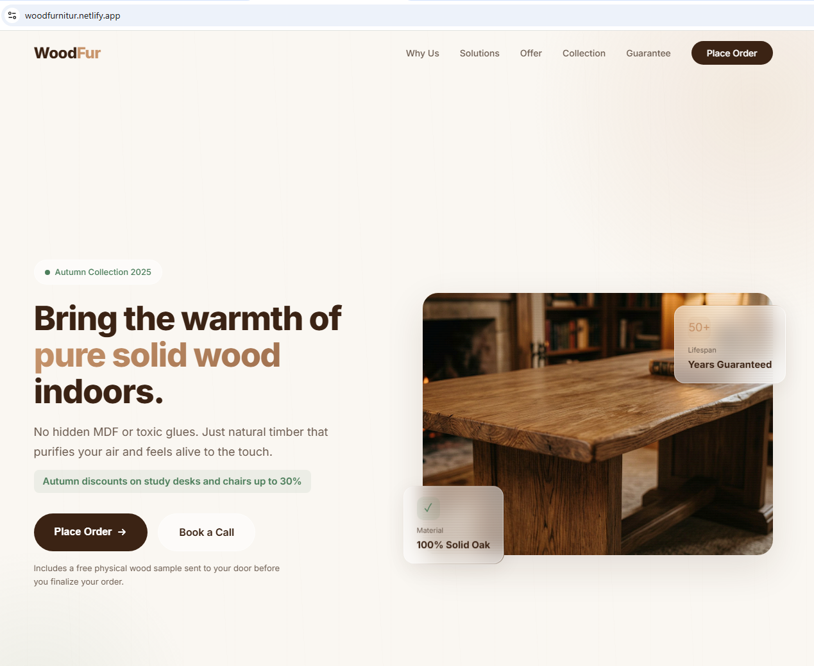
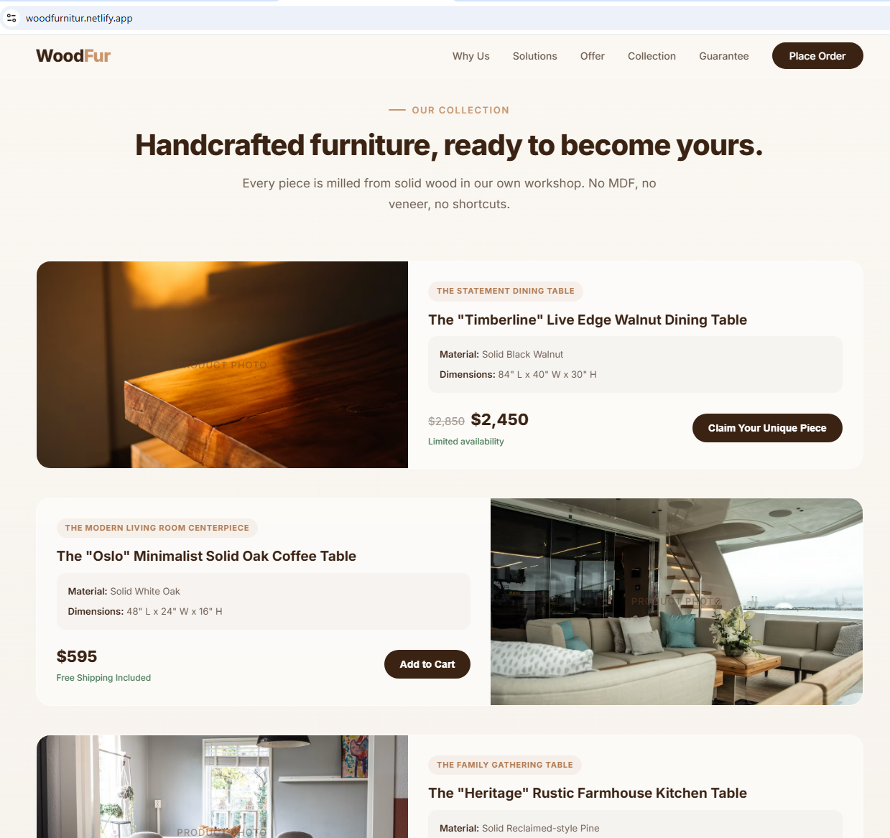
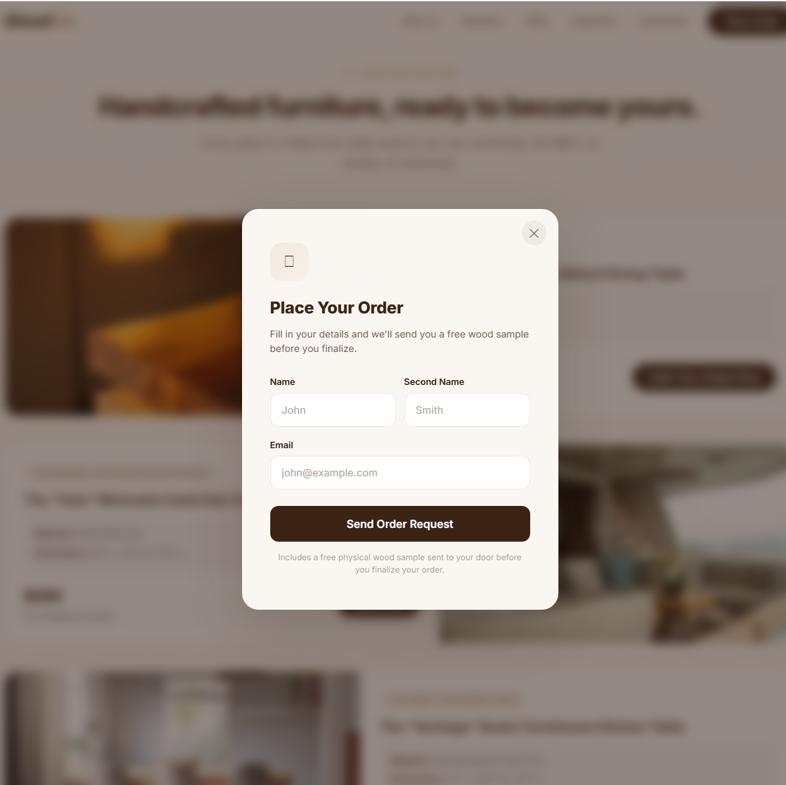

# WoodFur — Pure Solid Wood Furniture Landing Page

One-page landing site for a solid-wood furniture brand: pure-wood promise,
a 5-item product catalog, and an order-request form. Built to turn
visitors into leads, not to run an online store.

---

## What problem it solves

Most furniture sold today is MDF or veneer disguised as wood — it
off-gasses chemicals, peels, and wears out fast. WoodFur's customers can't
tell "real wood" from "fake wood" just by browsing a generic catalog page.
This site makes the difference explicit: it names the specific pains
(toxic air, peeling veneer, hollow feel), shows the solution for each one,
backs it with a concrete guarantee (sand a hidden spot — if it's not solid
wood, 200% refund), and only then shows the products — so the visitor
already trusts the material before seeing a price.

---

## Who it's for

- Buyers actively looking for solid-wood furniture (desks, tables,
  consoles) who are wary of MDF/veneer marketed as "wood."
- Visitors who need to be convinced before buying — not impulse shoppers,
  so the page leads with problem → solution → guarantee before the
  catalog.
- Mobile and desktop visitors alike — the layout is fully responsive.

---

## Main features / tech stack

**Features**
- Sticky glass-effect navbar with in-page anchor navigation.
- Scroll-reveal animations and a subtle parallax hero background.
- 5-product catalog: each card expands on hover to show full description,
  features, and specs.
- Order-request modal (name, second name, email) triggered from any
  "Place Order" / product CTA button.
- Pains → Solutions → Offer → Guarantee sections built around real
  objections to buying furniture online.

**Stack**
- Plain HTML/CSS/JS — everything in a single `index.html`, no framework,
  no build step.
- Google Fonts (`Inter`).
- Google Apps Script (`apps_script.gs`) as the order-form backend — writes
  submissions to a Google Sheet, no server or database to maintain.
- Hosted on Netlify.

---

## How to run

**View locally:** open `index.html` directly in a browser — no build step,
no dependencies.

**Deploy:** push the folder to Netlify (or any static host); the site is
plain static HTML/CSS/JS.

**Wire up the order form** (`apps_script.gs`):
1. Open Google Sheets → create a new spreadsheet.
2. Go to Extensions → Apps Script, delete the default code, paste
   `apps_script.gs`.
3. Replace `SPREADSHEET_ID` in the script with your sheet's ID (from its
   URL).
4. Deploy → New deployment → Web app. Execute as "Me," access "Anyone."
5. Copy the resulting web app URL into `index.html` where the form submits.

---

## Screenshots / live link

**Live demo:** https://woodfurnitur.netlify.app

| Hero | Product catalog |
|---|---|
|  |  |

| Order-request modal | AI chat consultant (demo) |
|---|---|
|  |  |

The chatbot demo is not wired into this site yet — it's the consultant bot
from the spec's optional "Site + AI chatbot" package (section 4.5 of the
technical specification), shown here as a proof of concept.

Other local reference images in this folder:
- `template.png` — design reference/mockup.
- `oak_table.jpg` — hero image used on the live page.

---

## Related documents

This site is the reference case ("WoodFur") cited in the technical
specification for pitching furniture-niche web development work:
`F:\DEV_HOME\ZEROCODER_Projects\8_Packaging\2\TZ_furniture_web_developer_landing.md`
(Upwork job: [Web Developer for Furniture Website](https://www.upwork.com/freelance-jobs/apply/Web-Developer-for-Furniture-Website_~022092571437501208185/)).
It matches that spec's "Landing page" package: 1 page, request form, no
backend to maintain.

---

## Contact

Andrey Naralchuk — `andrey.hamstering@gmail.com` · `t.me/AndreyHamstering`
